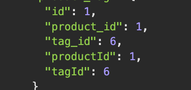

# Sequelize-E-Commerce-Back-End
11th Assignment of UCB Extension Web Development Bootcamp

Please visit the [Walkthrough video](https://drive.google.com/file/d/108q8cG13RXUC1fzZ5HlA1en3FA333Sa2/view?usp=share_link)
## Desciption
Using a functional Express.js API, connect it to a database using Sequelize by adding your database name, MySQL username, and MySQL password to an environment variable file. Then, you can create a development database by entering schema and seed commands to seed it with test data. When you invoke the application, your server will start and the Sequelize models will sync to the MySQL database.

You can use Insomnia to test your API routes. When you open API GET routes for categories, products, or tags, the data for each route will be displayed in a formatted JSON. You can also test API POST, PUT, and DELETE routes in Insomnia to create, update, and delete data in your database.
______________
## Disclaimer 


Unfortanetly, I could not get rid of this camelCase duplicates created by Sequelize. Even after an extensive search for a solution.

## Technology Used 
   
* [Git](https://git-scm.com/)   
* [JavaScript](https://www.javascript.com/)   
* [Node.js](https://nodejs.dev/)
* [MySQL](https://www.mysql.com/)
* [Sequelize](https://sequelize.org/)

## Requirements

Using comand line or a tool of your choice run MySQL commands from ```db/schema.sql ```.

Create .env file and add:
```
DB_NAME='ecommerce_db'
DB_USER=<ADD USER HERE>
DB_PASSWORD=<ADD YOUR PASSWORD HERE>
```

Run
```
npm install
```

## Author Info

### Liubov Sobolevskaya
* [LinkedIn](https://www.linkedin.com/in/liubov-sobolevskaya/)
* [Github](https://github.com/LiubovSobolevskaya)
* [Kaggle](https://www.kaggle.com/lyubovsobolevskaya)


